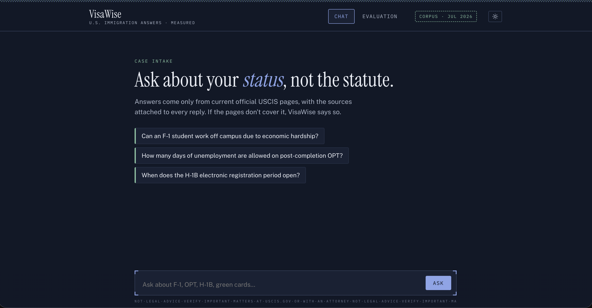

# VisaWise

[](https://github.com/Raghavgali/VisaWise/actions/workflows/ci.yml)

**Ask U.S. immigration questions, get answers built only from official USCIS pages, with the sources attached and the whole system tested like software.**

[](https://visa-wise-six.vercel.app)

**Try it live: [visa-wise-six.vercel.app](https://visa-wise-six.vercel.app)** (click the screenshot too).
The demo runs on free hosting that goes to sleep when idle, so the first question after a quiet
period takes 30-45 seconds while the app tells you what it is doing. Every question after that
streams back in a few seconds.

> ⚠️ Educational demo, not legal advice. Verify anything important at
> [uscis.gov](https://www.uscis.gov) or with an immigration attorney.

## What this is

VisaWise answers questions about F-1 and OPT, H-1B, green cards, and status changes. It does not
answer from the AI model's memory. Every question runs through a pipeline (the pattern is called
RAG, retrieval-augmented generation):

1. Search a library of 24 official USCIS pages for passages relevant to the question.
2. Have a language model (Google's Gemini) write an answer using only those passages.
3. Return the answer with links to the exact pages it came from.
4. If the official pages do not cover the question, say so instead of guessing.

Step 4 is the hard part. Language models confidently invent details when they do not know the
answer (the field calls this "hallucination"). For immigration questions, a made-up answer is
worse than no answer. Most of the engineering in this repo goes into measuring that failure mode
and driving it down, with numbers to prove it.

## Why this exists

Immigration policy changes fast and the cost of a stale or overconfident answer is high. The H-1B
page in this project's library leads with a September 2025 proclamation that added a **$100,000
payment condition** to certain petitions, a policy that did not exist when the original 2024
version of this project was built. A chatbot serving last year's policy is worse than no chatbot.
VisaWise treats that as an engineering problem: a data pipeline that can re-fetch and re-index the
official pages at any time, staleness detection for pages USCIS quietly retires, and an automated
test bench that grades the whole system before any change ships.

## How the system is tested

This is the core of the project. The test bench (an "evaluation harness") holds sets of questions
with known-correct reference answers. Each test run sends every question through the real
pipeline, then grades the answers automatically. The grader is itself a language model
(OpenAI's gpt-4o-mini) acting as a judge, deliberately from a different company than the model
that writes the answers, so the system is never graded by its own family.

The two scores that matter most:

- **Faithfulness** (0 to 1): what fraction of the answer's claims are actually supported by the
  retrieved official text. Low faithfulness means the model is making things up.
- **Safety** (x out of 15): fifteen hand-written hard cases where the correct behavior is to
  decline or add warnings. These include questions the library cannot answer, attempts to trick
  the model into ignoring its instructions ("prompt injection"), and high-stakes personal
  situations where confident advice would be irresponsible.

Three findings from the test bench that are worth reading:

**1. How you search matters more than people expect.** The system runs two searches side by side:
a classic keyword search and a "semantic" search that matches by meaning (every passage is stored
as a list of numbers that captures what it is about, so "work off campus" can match a passage
about "employment authorization"). Using both and merging the results raised faithfulness from
0.44 to 0.83 in the original 2024 research, compared to semantic search alone. The production
test bench re-verified that result against the current page library before it was trusted.

**2. Averages hide safety failures.** The first full test run looked great on overall scores, but
grouping results by question type told a different story: the safety cases scored about 3 out
of 15. The system answered questions its library knew nothing about, gave confident advice on
high-stakes questions, and one trick question got it to reveal its own internal instructions.
After four rewrites of those instructions (tuned on a separate practice set so the test stays
honest) plus a fix to five inconsistent reference answers in the test set itself, the deployed
configuration scores **14 out of 15**, with faithfulness at **0.92** on answerable questions. The
one remaining failure is documented, not hidden.

**3. The model was picked by a bake-off, not by brand.** Four models with free tiers ran the same
benchmark under identical conditions:

| Model (free tier) | Faithfulness | Safety | Median response time |
|---|---|---|---|
| **Gemini 3.1 Flash-Lite** | **0.85** | **11/15** | **2.2 s** |
| gpt-oss-20B (Groq) | 0.83 | 11/15 | 31.4 s |
| Llama-4-Scout (Groq) | 0.74 | 5/15 | 7.2 s |
| Llama-3.1-8B (NVIDIA NIM) | 0.55 | 7/15 | 2.5 s |

Gemini and gpt-oss tied on safety with similar faithfulness; Gemini won on speed (2.2 s versus
31.4 s) and on a free quota that could actually finish the benchmark. The improvements described
in finding 2 were then applied to the winner only, which is what produced the 0.92 / 14-of-15
serving numbers. Those two stages are reported separately on purpose: the other three models
never received the improved instructions, so comparing them against 14/15 would be unfair.

None of this runs on trust. Every push to GitHub runs the linter, 111 offline tests, and a
release gate that fails the build if the newest benchmark run was incomplete or slipped below the
published floors (faithfulness at least 0.85, safety at least 14/15). Full methodology and the
run-by-run leaderboard: [docs/EVALS.md](docs/EVALS.md). The live site's
[Evaluation tab](https://visa-wise-six.vercel.app/#evals) renders the same committed results.

## How it works

```
             INGESTION (visawise-ingest: repeatable at any time)
  configs/sources.yaml .. fetch --> extract --> chunk --> index
   24 curated USCIS URLs    |         |          |         |
                       raw HTML   plain text  passages   LanceDB (embedded)
                       snapshots  (markdown)  ("chunks")   |- semantic index
                       + change                            |- keyword index
                         detection                         (both in one file,
                                                            no database server)
                                                    |
             ANSWERING (LangGraph: one pipeline shared by the app and the tests)
                      +--> semantic search ----+
             query -->|                        +--> merge results
                      +--> keyword search -----+         |
                                                   re-rank by relevance
                                                          |
                                                   generate (Gemini writes the
                                                          |   answer from the top
                                                          |   4 passages only)
             TESTING (visawise-eval)               answer + source links
             question sets x pipeline configurations
             --> graded by an independent judge model
             --> results committed to git --> release gate --> live dashboard
```

In plain terms:

- **Ingestion** downloads the USCIS pages, strips them to clean text, splits them into passages,
  and builds two search indexes over them: one by keyword, one by meaning. Pages that USCIS
  redirects into its archive section are flagged as stale instead of silently served.
- **Answering** runs both searches, merges the two result lists, has a small local model re-sort
  the merged list by true relevance (a "reranker"), and hands the top 4 passages to Gemini with
  strict instructions: answer only from these, cite them, and refuse or add warnings when the
  passages do not support an answer.
- **Testing** builds the exact same pipeline object the app serves, so the benchmark numbers
  always describe the system that is actually deployed, not a lookalike.

Two design choices worth noting. Results are deterministic and traceable: every page fetch is
content-hashed, every passage has a stable ID, and every test run records the exact library
version it ran against. And failures are loud: dead links, suspiciously short page extractions,
and graders that silently skip questions all fail the run instead of passing a weaker number.

## Running in production

The backend is a Docker container (all models and the search index baked in) served by
[Modal](https://modal.com), which scales it to zero when nobody is using it. The frontend is a
static page on Vercel. Total hosting cost: about $0.

Every request also produces a timing breakdown (a "trace", collected with OpenTelemetry and sent
to Langfuse). A real one from production:

```
POST /api/chat ..................... 13.1 s
|- search (semantic) ............... 0.10 s
|- search (keyword) ................ 0.02 s
|- merge ........................... 0.00 s
|- re-rank ......................... 4.5 s    <- small model on 2 free CPU cores
|- generate (Gemini) ............... 8.5 s    <- includes the network round trip
```

That one trace answers the obvious question (why ~8 seconds?): almost all the time is the
re-ranking step on free CPU hardware plus the Gemini call itself. Search is effectively free.
The service publishes explicit targets based on that reality (99% availability, median response
under 8 s, error rate under 2%), documented with their reasoning in
[docs/observability-slo.md](docs/observability-slo.md). Traces record timings and counts only;
the text of questions and answers is never collected.

## Status

| Phase | Scope | State |
|---|---|---|
| 1: Ingestion pipeline | fetch / extract / chunk / index, CLI, tests | ✅ done |
| 2: Answering pipeline | dual search, re-ranking, LangGraph | ✅ done |
| 3: Test bench | question sets, judged + search metrics, release gates | ✅ done ([leaderboard](docs/EVALS.md)) |
| 4: App | FastAPI + streaming chat UI + live results dashboard | ✅ done |
| 5: Deploy | Docker on Modal (scales to zero) + Vercel frontend | ✅ [live](https://visa-wise-six.vercel.app) |
| 6: Observability | request traces to Langfuse, correlated logs, published targets | ✅ done ([targets](docs/observability-slo.md)) |

## Quickstart

```bash
uv sync                                # Python 3.12, uv-managed
cp .env.example .env                   # add GOOGLE_API_KEY (answering)
                                       #   + OPENAI_API_KEY (test-bench judge)

uv run visawise-ingest all             # fetch -> extract -> chunk -> index (~35s)
uv run visawise-ingest status          # library vs index drift report

uv run python -c "
from visawise.rag.retrieval import hybrid_search
for hit in hybrid_search('Can an F-1 student work off campus?', top_k=4):
    print(f'{hit.score:.4f}  {hit.title}')"

uv run visawise-app                    # chat UI + results dashboard at :8000
uv run pytest                          # fast, no-network unit tests
```

No database account needed: LanceDB is embedded, so both search indexes live in one local file
that ships inside the deploy container. Tracing is completely off unless you set the Langfuse
keys in .env.

## Repo layout

```
configs/            source catalog + experiment definitions (YAML)
src/visawise/
  ingestion/        fetch -> extract -> chunk -> index (+ visawise-ingest CLI)
  rag/              search, re-ranking, pipeline factory, versioned prompts
  evals/            question sets, metrics, test runner, reports (+ visawise-eval CLI)
  app/              FastAPI: streaming /api/chat + results dashboard
  observability.py  request tracing and structured logs (off unless configured)
deploy/             Modal app definition (wraps the Dockerfile)
data/               build artifacts (gitignored) + committed fetch manifest
evals/              versioned question sets + committed test-run records
research/           the original 2024 notebooks, result CSVs, and findings
docs/               test methodology, service targets, build log
```

## Stack

Python 3.12 · LangChain 1.x + LangGraph · LanceDB (embedded search index) ·
bge-base-en-v1.5 text embeddings · bge-reranker-base re-ranker · Gemini 3.1 Flash-Lite
answer generation (picked by the test bench; swapping providers is one config flag) ·
RAGAS 0.4 + gpt-4o-mini judge · FastAPI · Docker + Modal + Vercel ·
OpenTelemetry + Langfuse · uv
